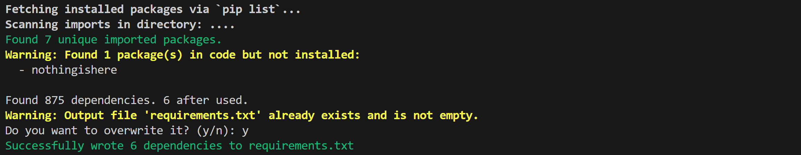

# uv-slow: An extremely slow Python package and project manager

A minimal tool to clean and generate `requirements.txt` from `pip list` output.

## Introduction

What are the modern, efficient, and convenient Python package management tools? **uv** and **Poetry**.

- [uv](https://docs.astral.sh/uv/)

- [poetry](https://python-poetry.org/)

These tools create project-specific virtual environments, effectively solving the problem of "dependency hell" that often plagues Python version management.

However, for **existing codebases that don't use Poetry or uv**, or for **developers who prefer to manage environments with system-level tools** like **Conda**, the dependency hell problem remains difficult to solve. 

A significant reason for this is that **developers often don't properly maintain their `requirements.txt` files**. A tiny difference between server-side and local dependencies can lead to the entire system failing to function correctly.

The fact that your local environment runs smoothly doesn't mean your project dependencies are clean. We often run into situations where a `requirements.txt` file exported via `pip freeze` from the local environment contains a large number of redundant packages that the project doesn't actually need. This not only makes installation on a new environment take longer but also has the potential to introduce unnecessary dependency conflicts. Therefore, generating a **minimalist, core** `requirements.txt` file is crucial. It ensures the reproducibility of your project environment, boosts deployment efficiency, and reduces potential dependency issues.

This is where `uv-slow` comes in. It was created to solve the problem of automatically generating a **clear, accurate, and reproducible** `requirements.txt` file, particularly for developers using system-level virtual environments like Conda. It aims to ensure that the dependencies required for your project are precisely documented, making it easy to replicate the exact same environment anywhere.

- `uv-slow` is much slower than `uv` for it is written in Python.

- `uv-slow` is much cruder than `uv` for it only support generating `requirements.txt`

- but I use `uv-slow` more than `uv` because I have written so many rubbish code in the past! 🤓

## Installation

`uv-slow` is purely written on Python standard library modules, so you don't need to install any packages for preliminaries!

```bash
# clone the project
git clone https://github.com/xiyuanyang-code/uv-slow.git
cd uv-slow

# install locally
pip install -e .
```

Type into your cli for `uvslow -h` for more messages!

```text
usage: uvslow [-h] [-o OUTPUT] [-e [EXCLUDE ...]] [-d DIRECTORY] [--dry-run] [--scan-imports] [--no-scan-imports]

Clean and generate requirements.txt from pip list.

options:
  -h, --help            show this help message and exit
  -o OUTPUT, --output OUTPUT
                        Output file name.
  -e [EXCLUDE ...], --exclude [EXCLUDE ...]
                        Packages to exclude.
  -d DIRECTORY, --directory DIRECTORY
                        Directory to scan for imports.
  --dry-run             Show what would be written without writing.
  --scan-imports        Scan Python files for imports.
  --no-scan-imports     Disable scanning.
```

## Usage

```bash
# Basic usage (scans current directory by default, and attempts to write into requirements.txt)
uvslow

# Specify output file
uvslow -o my_requirements.txt

# Exclude specific packages
uvslow -e numpy pandas

# Dry run to see what would be written, but not actually written
uvslow --dry-run

# Disable import scanning
uvslow --no-scan-imports

# Scan imports in specific directory
uvslow -d /path/to/project

# Combine options
uvslow -o requirements.txt -e setuptools pip --dry-run
```

## Demo

See [Example project](./example/) for more details.



```text
# Python Version 3.12.2 | packaged by conda-forge | (main, Feb 16 2024, 20:50:58) [GCC 12.3.0] is recommended
# Several Dependencies: 
Flask==3.1.1
numpy==1.26.4
requests==2.32.4
torch==2.6.0+cpu
torchaudio==2.6.0+cpu
torchvision==0.21.0+cpu
```
